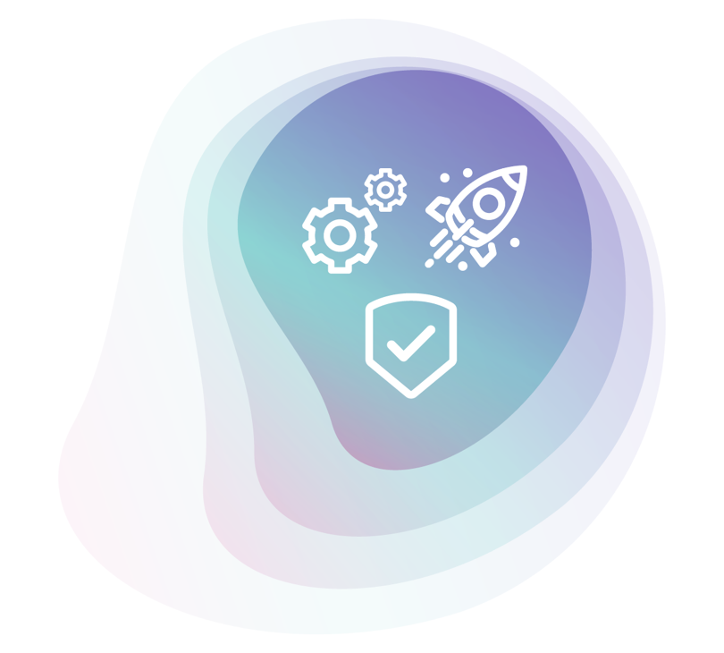

# Principled GraphQL

  

GraphQL, despite the name, isn't simply a query language. It's a comprehensive solution to the problem of connecting modern apps to services in the cloud. As such, it forms the basis for a new and important layer in the modern application development stack: the **graph**. This new layer brings all of a company's app data and services together in one place, with one consistent, secure, and easy-to-use interface, so that anyone can draw upon it with minimal friction.

At [**Apollo**](https://apollographql.com), we've been building industry leading graph technology since 2015, and we estimate our software is now used in over 90% of GraphQL implementations. Over the years, we've had thousands of conversations with developers implementing GraphQL at companies of all sizes. We want to share what we've learned, so we've distilled their experiences into a set of best practices for creating, maintaining, and operating a graph. We present them here as 10 GraphQL Principles, broken out into three categories, in a format inspired by the [Twelve Factor App](https://12factor.net).
